# MagicHemp Resource Pack - Minecraft 1.20.1

<p align="center">
  
</p>

> **AVISO IMPORTANTE: ESTE PROJETO E INDICADO PARA MAIORES DE 18 ANOS.**  
> **O tema Magic Hemp, sua identidade visual e sua proposta premium foram pensados para publico adulto.**

<p align="center">
  <a href="https://github.com/gorpo/MagicHemp-forge-1.20.1-47.4.10-mdk">
    
  </a>
</p>

> **ESTE RESOURCE PACK FOI FEITO PARA SER USADO JUNTO COM O MOD MAGIC HEMP FORGE 1.20.1:**  
> **Mod oficial:** https://github.com/gorpo/MagicHemp-forge-1.20.1-47.4.10-mdk  
> **Use o mod + este resource pack para ter a experiencia visual completa do Magic Hemp.**

> **ORDEM OBRIGATORIA DOS PACKS NO MINECRAFT, DE CIMA PARA BAIXO:**  
> **1. `MagicHemp_1.20.1_Premium526X` -> 2. `MagicHemp_1.20.1_models` -> 3. `MagicHemp_1.20._addon` -> 4. `MagicHemp_1.20.1_bonus`**  
> **Use exatamente essa ordem para as texturas, modelos e sobreposicoes funcionarem corretamente.**

<p align="center">
  
  
  
  
</p>

**Criador:** GuiPaluch  
**Versao do Minecraft:** Java Edition 1.20.1  
**Pack format:** 15  
**Formato deste repositorio:** resource pack descompactado, dividido em modulos  

MagicHemp Resource Pack e um pacote visual completo para Minecraft 1.20.1 criado por **GuiPaluch**. O projeto foi organizado em quatro resource packs separados para permitir carregamento em camadas, controle de prioridade e manutencao mais simples sem depender de um unico ZIP enorme.

Este repositorio esta descompactado porque o pacote completo fica grande demais para um fluxo confortavel em arquivo unico. Mantendo as pastas abertas, o GitHub consegue versionar os arquivos individualmente, o conteudo fica navegavel e cada modulo pode ser baixado, revisado ou atualizado separadamente.

---

## Previews

### Icones dos quatro packs

<table>
  <tr>
    <td align="center"><strong>1 - Premium526X</strong><br></td>
    <td align="center"><strong>2 - Models</strong><br></td>
    <td align="center"><strong>3 - Addon</strong><br></td>
    <td align="center"><strong>4 - Bonus</strong><br></td>
  </tr>
</table>

### Amostras compactas das texturas

O resource pack possui dezenas de milhares de imagens. A grade abaixo mostra uma amostra compacta das principais texturas em quadrados pequenos, lado a lado, para visualizar o estilo do pacote sem deixar o README pesado demais.

<table>
  <tr>
    <td align="center"><br><sub>Grass</sub></td>
    <td align="center"><br><sub>Dirt</sub></td>
    <td align="center">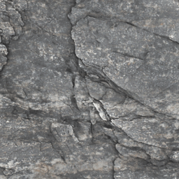<br><sub>Stone</sub></td>
    <td align="center">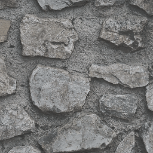<br><sub>Cobblestone</sub></td>
    <td align="center"><br><sub>Oak Log</sub></td>
    <td align="center">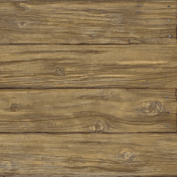<br><sub>Oak Planks</sub></td>
  </tr>
  <tr>
    <td align="center">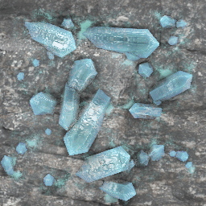<br><sub>Diamond Ore</sub></td>
    <td align="center"><br><sub>Emerald Ore</sub></td>
    <td align="center"><br><sub>Gold Ore</sub></td>
    <td align="center"><br><sub>Iron Ore</sub></td>
    <td align="center">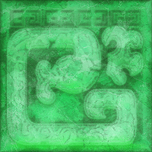<br><sub>Emerald Block</sub></td>
    <td align="center">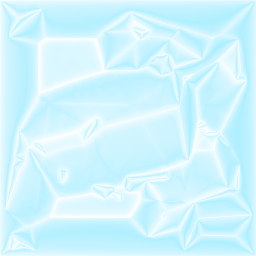<br><sub>Diamond Block</sub></td>
  </tr>
  <tr>
    <td align="center"><br><sub>Portal</sub></td>
    <td align="center"><br><sub>Lava</sub></td>
    <td align="center"><br><sub>Water</sub></td>
    <td align="center">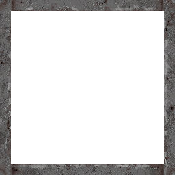<br><sub>Glass</sub></td>
    <td align="center">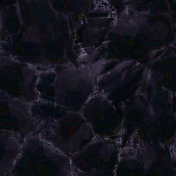<br><sub>Obsidian</sub></td>
    <td align="center">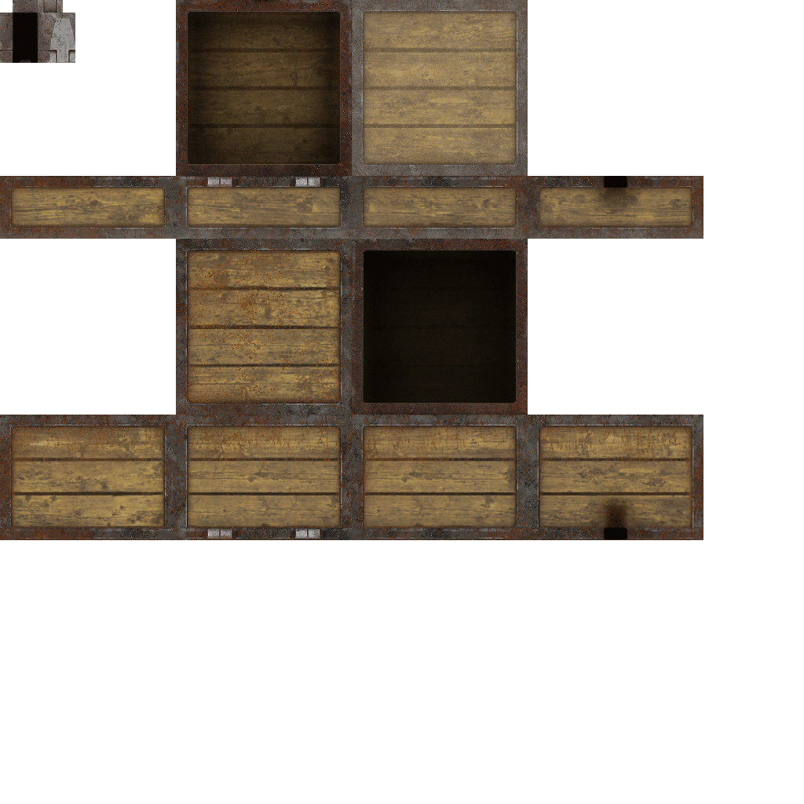<br><sub>Chest</sub></td>
  </tr>
  <tr>
    <td align="center">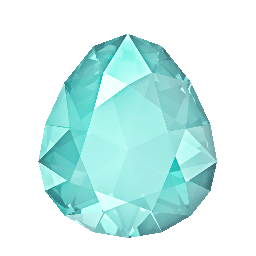<br><sub>Diamond</sub></td>
    <td align="center">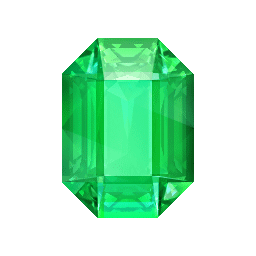<br><sub>Emerald</sub></td>
    <td align="center"><br><sub>Gold</sub></td>
    <td align="center">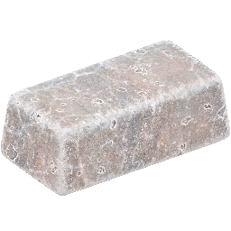<br><sub>Iron</sub></td>
    <td align="center"><br><sub>Netherite</sub></td>
    <td align="center">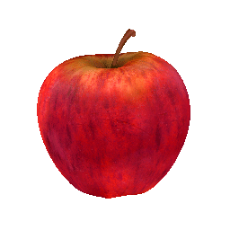<br><sub>Apple</sub></td>
  </tr>
  <tr>
    <td align="center">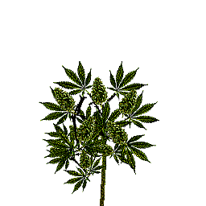<br><sub>Allium</sub></td>
    <td align="center"><br><sub>Flower</sub></td>
    <td align="center">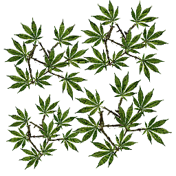<br><sub>Leaves</sub></td>
    <td align="center">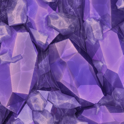<br><sub>Amethyst</sub></td>
    <td align="center"><br><sub>Crafting</sub></td>
    <td align="center">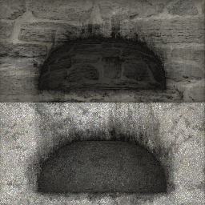<br><sub>Furnace</sub></td>
  </tr>
</table>

---

## Sobre o projeto

MagicHemp Resource Pack foi preparado para transformar a experiencia visual do Minecraft 1.20.1 com texturas, modelos, configuracoes OptiFine e camadas adicionais de acabamento. O pacote foi pensado como um conjunto modular: cada pasta e um resource pack valido, com `pack.mcmeta`, `pack.png` e sua propria estrutura de `assets`.

A proposta e entregar uma identidade visual MagicHemp forte, com foco em detalhes, materiais mais ricos, texturas de blocos e itens, modelos especiais, colormaps e recursos avancados quando o ambiente do jogador suporta essas funcoes.

O criador e mantenedor deste resource pack e **GuiPaluch**.

---

## Estrutura do repositorio

```text
MagicHempResourcePack/
├── MagicHemp_1.20.1_Premium526X/
├── MagicHemp_1.20.1_models/
├── MagicHemp_1.20._addon/
├── MagicHemp_1.20.1_bonus/
├── README.md
├── .gitignore
└── .gitattributes
```

Cada uma das quatro pastas principais deve ser tratada como um resource pack independente dentro do Minecraft.

---

## Modulos incluidos

| Posicao | Modulo | Funcao | Arquivos | Tamanho aproximado |
| ---: | --- | --- | ---: | ---: |
| 1 | `MagicHemp_1.20.1_Premium526X` | Camada principal e premium do MagicHemp | 42.776 | 1029 MB |
| 2 | `MagicHemp_1.20.1_models` | Modelos customizados extras | 95 | 0,1 MB |
| 3 | `MagicHemp_1.20._addon` | Addon visual com extensoes e detalhes extras | 9.117 | 327 MB |
| 4 | `MagicHemp_1.20.1_bonus` | Conteudo complementar bonus | 2.083 | 105 MB |

Os numeros podem variar um pouco dependendo do sistema de arquivos, do download feito pelo GitHub e de futuras atualizacoes do pacote.

---

## Ordem obrigatoria/recomendada no Minecraft

Os `pack.mcmeta` dos modulos indicam a ordem de prioridade. No menu de resource packs do Minecraft, packs no topo tem prioridade sobre packs abaixo.

Ordem recomendada de cima para baixo:

1. `MagicHemp_1.20.1_Premium526X`
2. `MagicHemp_1.20.1_models`
3. `MagicHemp_1.20._addon`
4. `MagicHemp_1.20.1_bonus`

Essa ordem deve ser respeitada para que as sobreposicoes funcionem como planejado. Se a ordem for alterada, algumas texturas, modelos ou variacoes podem nao aparecer como esperado.

---

## Compatibilidade

Este resource pack foi preparado para:

- Minecraft Java Edition 1.20.1
- `pack_format` 15
- Uso como resource pack descompactado
- Instancias vanilla com suporte basico a resource packs
- Melhor aproveitamento com OptiFine ou alternativas compativeis com recursos visuais avancados

Alguns recursos podem depender de suporte externo para aparecer corretamente, como:

- Connected Textures em `assets/minecraft/optifine/ctm`
- Custom Entity Models em `assets/minecraft/optifine/cem`
- Colormaps e configuracoes em `assets/minecraft/optifine`
- Modelos customizados em `assets/minecraft/models`
- Texturas normais, especulares ou auxiliares quando suportadas pelo ambiente de renderizacao

Sem suporte a esses recursos, o Minecraft ainda pode carregar texturas basicas, mas parte dos efeitos avancados pode nao aparecer.

---

## Como instalar

### Instalacao manual

1. Baixe este repositorio pelo GitHub usando `Code > Download ZIP`, ou clone com Git.
2. Se usar `Download ZIP`, extraia o ZIP do repositorio.
3. Abra a pasta extraida do repositorio. Dentro dela existem quatro pastas de resource pack prontas para uso.
4. Abra a pasta do Minecraft.
5. Entre em `.minecraft/resourcepacks`.
6. Copie para `resourcepacks` somente estas quatro pastas, nao copie a pasta raiz do repositorio:
   - `MagicHemp_1.20.1_Premium526X`
   - `MagicHemp_1.20.1_models`
   - `MagicHemp_1.20._addon`
   - `MagicHemp_1.20.1_bonus`
7. Abra o Minecraft 1.20.1.
8. Va em `Opcoes > Pacotes de recursos`.
9. Ative os packs seguindo a ordem indicada acima.
10. Clique em `Concluido` e aguarde o Minecraft recarregar.

Importante: este repositorio guarda os packs descompactados para facilitar backup, navegacao e atualizacoes no GitHub. O Minecraft aceita resource packs como pastas descompactadas, desde que cada pasta tenha seu proprio `pack.mcmeta` diretamente dentro dela.

### Instalacao por ZIP dos packs

Quando houver uma versao publicada em `Releases`, voce podera baixar os packs ja compactados individualmente. Nesse caso, coloque os quatro arquivos `.zip` diretamente em `.minecraft/resourcepacks` e ative na mesma ordem obrigatoria:

1. `MagicHemp_1.20.1_Premium526X.zip`
2. `MagicHemp_1.20.1_models.zip`
3. `MagicHemp_1.20._addon.zip`
4. `MagicHemp_1.20.1_bonus.zip`

Nao extraia esses ZIPs individuais dentro da pasta `resourcepacks`, porque eles ja serao os resource packs prontos.

### Instalacao via Git

Para clonar diretamente:

```bat
git clone https://github.com/gorpo/MagicHemp_ResourcePack-Minecraft_1.20.1.git
```

Depois copie as quatro pastas do repositorio para a pasta `resourcepacks` do Minecraft.

---

## Como atualizar

Se voce clonou com Git:

```bat
cd MagicHemp_ResourcePack-Minecraft_1.20.1
git pull
```

Depois copie novamente as pastas atualizadas para `.minecraft/resourcepacks`.

---

## Conteudo visual esperado

O MagicHemp Resource Pack trabalha com varias camadas visuais:

- Texturas de blocos em alta resolucao
- Texturas de itens
- Texturas de entidades
- Texturas de armaduras e equipamentos
- Modelos de blocos e itens
- Custom Entity Models quando suportado
- Connected Textures para blocos compativeis
- Colormaps e ajustes de cor
- Propriedades OptiFine para regras visuais especificas
- Camadas adicionais de addon e bonus
- Modelos extras separados em pack proprio

A pasta `MagicHemp_1.20.1_Premium526X` concentra a maior parte do pacote. `MagicHemp_1.20.1_models`, `MagicHemp_1.20._addon` e `MagicHemp_1.20.1_bonus` complementam a base com sobreposicoes e recursos especificos.

---

## Observacoes de desempenho

Este resource pack e grande. Em computadores com pouca memoria, armazenamento lento ou GPU limitada, o carregamento pode demorar mais.

Recomendacoes:

- Use Minecraft 1.20.1.
- Aumente a memoria alocada se o jogo travar ao carregar resource packs grandes.
- Teste primeiro com os packs sem shaders.
- Ative os packs na ordem correta.
- Se houver problema, teste um modulo por vez.
- Feche outros programas pesados durante o primeiro carregamento.
- Mantenha drivers de video atualizados.

---

## Solucao de problemas

### O pack aparece como incompativel

Confirme que voce esta usando Minecraft 1.20.1. O `pack_format` usado nos packs e 15.

### O pack nao aparece no menu

Verifique se voce copiou as pastas corretas. O Minecraft precisa encontrar `pack.mcmeta` diretamente dentro de cada pasta do resource pack.

Correto:

```text
resourcepacks/MagicHemp_1.20.1_Premium526X/pack.mcmeta
resourcepacks/MagicHemp_1.20.1_models/pack.mcmeta
resourcepacks/MagicHemp_1.20._addon/pack.mcmeta
resourcepacks/MagicHemp_1.20.1_bonus/pack.mcmeta
```

Errado:

```text
resourcepacks/MagicHempResourcePack/MagicHemp_1.20.1_Premium526X/pack.mcmeta
```

Se voce colocar a pasta raiz inteira dentro de `resourcepacks`, o Minecraft pode nao detectar os quatro packs diretamente.

### As texturas avancadas nao aparecem

Alguns recursos podem depender de OptiFine ou compatibilidade equivalente. Confira se o seu ambiente suporta CTM, CEM, colormaps e modelos customizados.

### O jogo demora para carregar

O pacote contem muitos arquivos e passa de 1 GB. O primeiro carregamento pode demorar. Isso e esperado para um resource pack desse tamanho.

### O Minecraft fecha ao ativar todos os packs

Teste uma ativacao por etapas:

1. Ative apenas `MagicHemp_1.20.1_Premium526X`.
2. Reinicie o jogo.
3. Adicione `MagicHemp_1.20.1_models`.
4. Reinicie e teste.
5. Adicione `MagicHemp_1.20._addon`.
6. Por ultimo, adicione `MagicHemp_1.20.1_bonus`.

Se funcionar em partes, o problema pode estar ligado a memoria, renderizador, shaders ou conflito com outro pack/mod.

---

## Para desenvolvedores e colaboradores

Este repositorio guarda o resource pack descompactado. Isso facilita navegar pelos arquivos no GitHub, revisar JSONs e propriedades, comparar mudancas e manter as quatro partes do pacote de forma organizada.

Pontos importantes:

- Evite commitar ZIPs gerados localmente.
- Mantenha os nomes das quatro pastas principais estaveis.
- Nao remova `pack.mcmeta` nem `pack.png` dos modulos.
- Edite cada arquivo dentro do modulo correto.
- Ao adicionar imagens grandes, confirme que cada arquivo fica abaixo de 100 MB.
- O repositorio e pesado; clones e pushes podem demorar.
- Use commits descritivos quando alterar texturas, modelos ou configuracoes.

---

## Limites e formato do repositorio

O GitHub bloqueia arquivos comuns acima de 100 MB. Neste pacote, os arquivos individuais ficam abaixo desse limite, por isso o conteudo pode ser versionado descompactado. O tamanho total do repositorio, porem, e grande: aproximadamente 1,53 GB.

Isso significa que baixar ou clonar o projeto pode levar tempo, dependendo da internet e do computador.

---

## Autoria

**MagicHemp Resource Pack - Minecraft 1.20.1**  
Criado por **GuiPaluch**.

Este README deixa registrado que o resource pack, sua organizacao neste repositorio e sua distribuicao sob o nome MagicHemp sao mantidos pelo criador **GuiPaluch**.

---

## Status

- Minecraft alvo: 1.20.1
- Pack format: 15
- Distribuicao: descompactada
- Modulos: 4
- Arquivos: aproximadamente 54.077
- Tamanho total: aproximadamente 1,53 GB
- Criador: GuiPaluch

---

## Creditos

Criador e responsavel pelo resource pack: **GuiPaluch**.

Obrigado por usar o MagicHemp Resource Pack.
